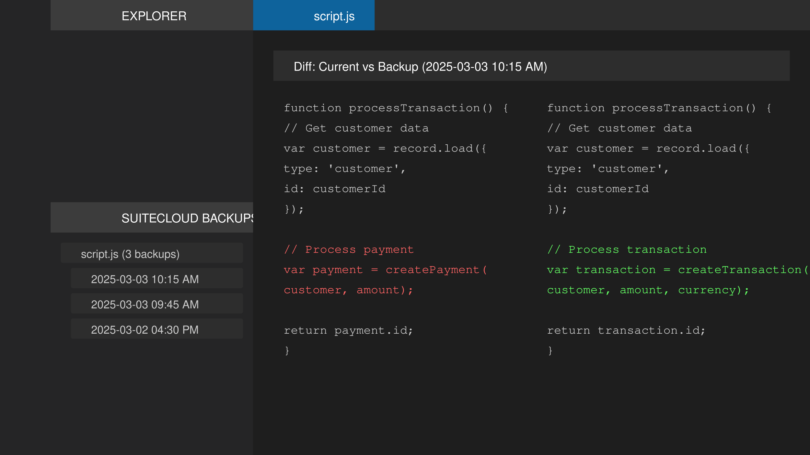

# SuiteCloud Backup

A Visual Studio Code extension that enhances the SuiteCloud development workflow by providing automatic backups and difference tracking when uploading files to NetSuite.

## Features

- **Automated Backups**: Automatically creates backups of both local and NetSuite account versions of your files during upload.
- **Diff Comparison**: Quickly compare differences between local and account versions.
- **Backup History**: Keep track of all previous versions with timestamps and metadata.
- **Simple Restoration**: Easily restore from any backup version with a single click.
- **Intuitive UI**: View and manage all your backups through the dedicated sidebar view.

## Requirements

- Visual Studio Code 1.60.0 or higher
- Node.js 14.0.0 or higher
- SuiteCloud CLI installed (`npm install -g @oracle/suitecloud-cli`)
- Valid NetSuite account with API access

## Installation

You can install this extension directly from the VS Code Marketplace:

1. Open VS Code
2. Go to Extensions (Ctrl+Shift+X)
3. Search for "SuiteCloud Backup"
4. Click Install

## Setup

1. Open your SuiteCloud project in VS Code
2. Configure your authentication ID in one of these ways:
   - In your project's `project.json` file with `defaultAuthId` property
   - In VS Code settings with `suitecloudbackup.defaultAuthId`
   - The extension will prompt you to set up authentication if none is found

## Usage

### Uploading Files with Backup

Right-click on a SuiteScript file in the Explorer or Editor and select "SuiteCloud: Upload File with Backup". The extension will:

1. Create a local backup of your file
2. Upload the file to NetSuite
3. Import the NetSuite account version
4. Create a backup of the account version
5. Restore your local version
6. Show differences if the versions are not identical

### Managing Backups

1. Click on the "SuiteCloud Backups" view in the Explorer sidebar
2. Browse through your backed-up files and their versions
3. Right-click on any backup to:
   - View differences between backup and current version
   - Restore the backup version

## Configuration

This extension provides the following settings:

- `suitecloudbackup.backupDirectory`: Directory to store backups (default: "backups" in workspace)
- `suitecloudbackup.defaultAuthId`: Default authentication ID for SuiteCloud operations

## Known Issues

- File paths with special characters may cause issues on some systems
- Very large files may take longer to process

## Troubleshooting

### Operation Hangs During Restoration
If the operation appears to hang during the "Restoring local version..." step:
- Cancel the operation (if possible)
- Try processing the file again
- If problems persist, try using a smaller file

### Missing Account Information
If you don't see account information in the SuiteCloud Backups panel:
1. Click the refresh icon in the panel header to force reload account information
2. Ensure your SuiteCloud project is properly set up with authentication
3. Check that your project.json file contains valid account-specific values

### Timeout Errors
The extension now includes timeout protection for operations that might hang. If you see timeout errors:
1. Check your network connection to NetSuite
2. Verify that your authentication credentials are valid
3. Try the operation again

## Release Notes

### 0.1.0

- Initial release with core backup and restore functionality
- Support for tracking differences between local and account versions
- Backup explorer view

## Contributing

Found a bug or have a feature request? Please open an issue on our [GitHub repository](https://github.com/Gregox01/suitecloudbackup).

## License

This extension is licensed under the MIT License. See the LICENSE file for details.

---

**Developed by Gregorio Llabra.**